# Introduction

I am not a good chess player. Far from it. I even hate videogames with time limits that force you to be *quick* rather than *good*. As a consequence, the time limit in chess 

However, the Data Scientist me rejoice in understanding how to train a chess engine. I love watching the chess *analysis* through youtube (ranging from the Italian superspeed-scacchi, scacchi con Gabriel, to the English ...). As a consequence, lately I started playing chess after many years. 

I was never a good player in the past -- barely knowing how to move the pieces since I was a kid. To understand the level I was when I started playing chess as an adult, here is one of my first games:

# The first game

Metti partita semplice.

## Lesson learned

The lesson I learned was to start with a sound opening. Nothing too fancy, so I went for 

# The game

**Move 1**

White moves: **e2e4**

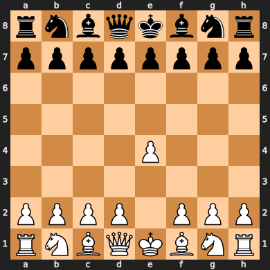

Black moves: **e7e5**

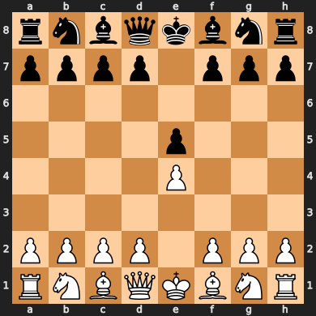

**Move 2**

White moves: **d1h5**

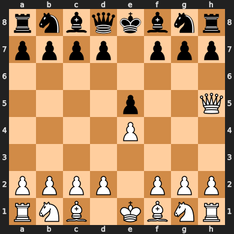

Black moves: **b8c6**

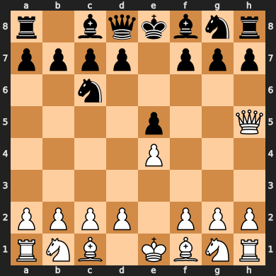

**Move 3**

White moves: **f1c4**

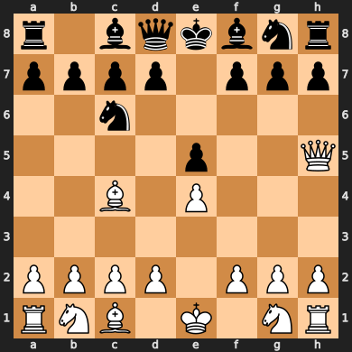

Black moves: **g7g6**

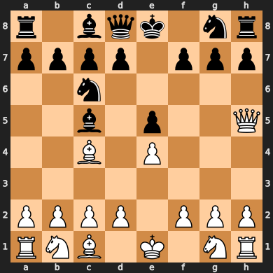

**Move 4**

White moves: **h5f3**

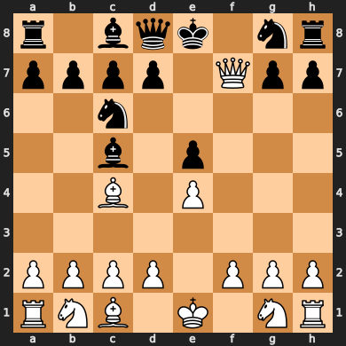

Black moves: **g8h6**

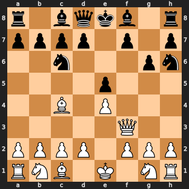

**Move 5**

White moves: **g2g4**

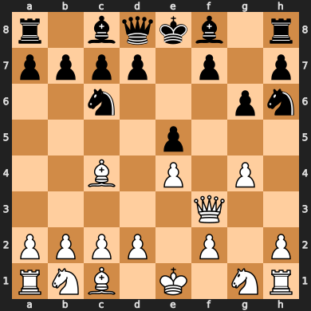

Black moves: **d7d6**

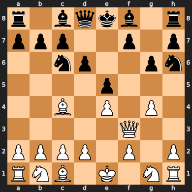

**Move 6**

White moves: **g4g5**

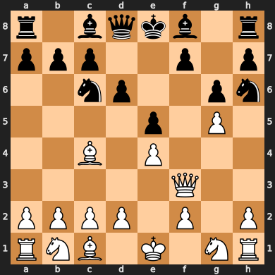

Black moves: **h6g4**

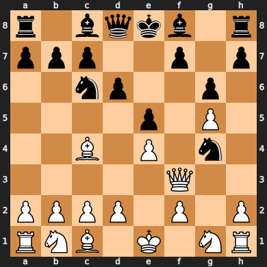

**Move 7**

White moves: **f3f7**

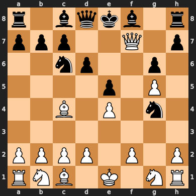
